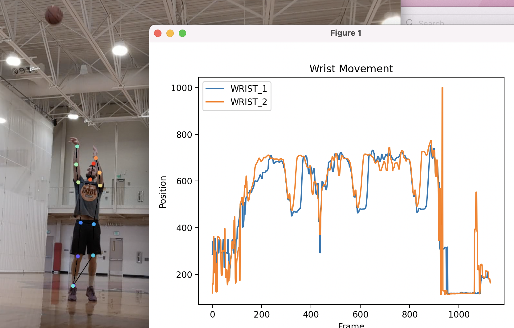
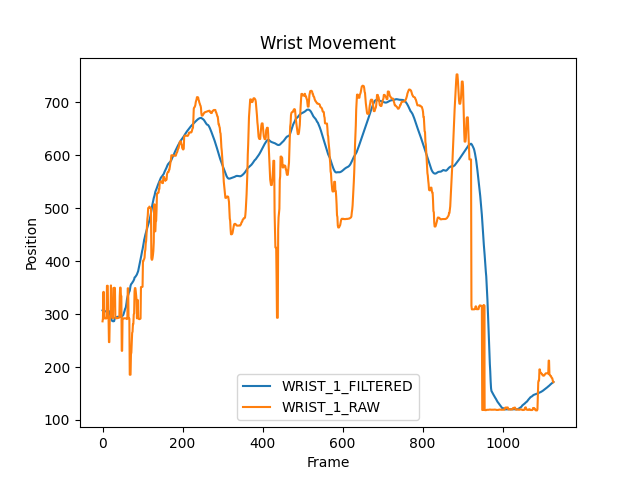
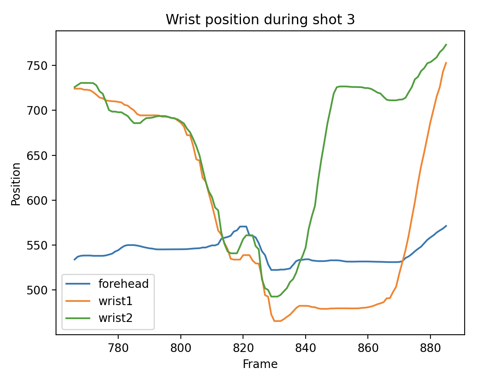
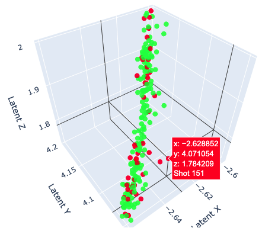
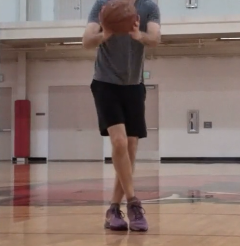
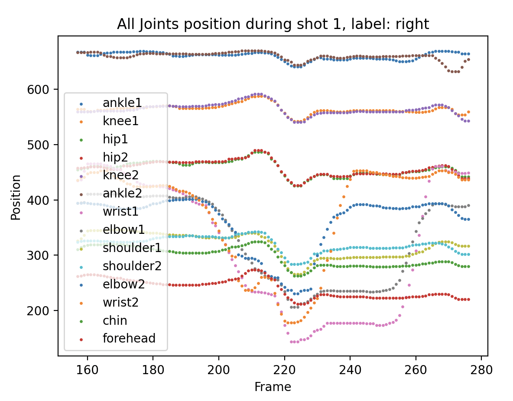
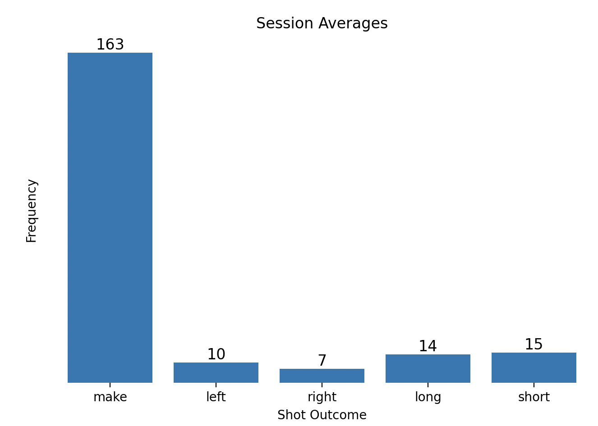
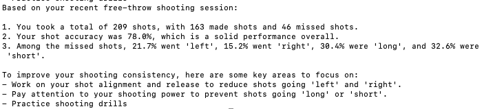
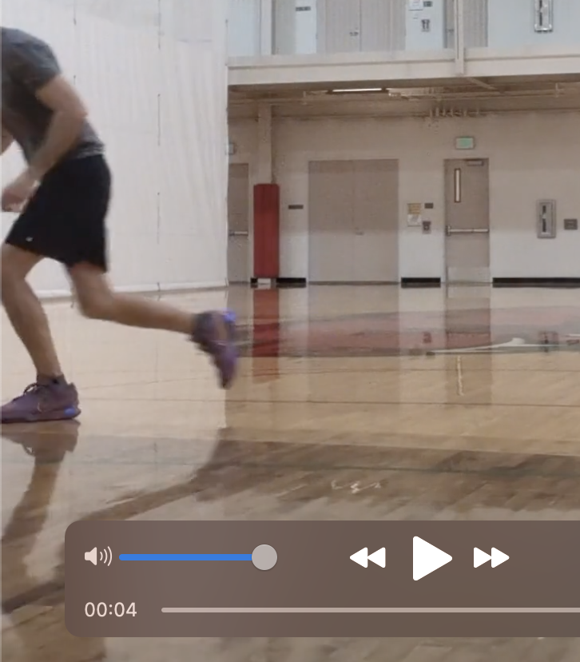

This is a project that employs a medley of huggingface models, speech-to-text, time-series analysis, visualization, and LLM prompt engineering to provide feedback to a basketball player as they practice their shot.

   
  <em>Visualization of DeepLabCut's output during a freethrow attempt.</em>

## Motivation
I have long been interested in how computer vision can mesh with biomechanics for various purposes, from creating interactive art displays to improving sport performance, rehabilitation, wildlife tracking, and more. I made this project to get experience working with frameworks relevant to this line of work.

## The Data
All good AI projects need to start with data. There are many more data sources I could have collected, but my aim was to make something that other people would be able to use on themselves with minimal budget and setup.

At the end of the day, I wanted to collect biomechanical data for each shot, and a label that determined where the ball ended up: "make" or "miss". If I did miss, I wanted to record which direction the ball missed to. 

So, I devised a plan to capture this: I went to the gym and put on some headphones. I set up my phone camera to record myself shooting freethrows, and set the video to capture audio from my headphones instead of the phone. Then, I got in front of the camera and started shooting freethrows. After each shot, I said aloud either "make", "left", "right", "short", or "long".

## Extracting Pose Information from Video

My first data-wrangling goal was to extract a useful represention of biomechanic "pose" data for basketball shooting sessions. I researched many APIs to achieve this task, and ultimately decided to choose DeepLabCut because their API will work on huggingface models for non-human animal research also, and I am interested in doing that in the future. After a brief wrestling match with installation and pathing issues, I got my small laptop to successfully run this software on a proof-of-concept 30-second video of myself shooting exactly 3 free throws. For larger videos down the line, I turned to Google Colab for compute resources.

### Section 2.1: Interpreting Pose Information

I started with a video of three shots so it would be easy to create and test heuristics to capture a known set of shots. I started by loading the data into a pandas dataframe, visualizing the wrist data of the video, and comparing it to when I actually shot the ball. It became clear that I could tell which actions indicated shots, but there was noise in the data. So, I experimented with filtering the data before defining heuristics for shot detection. I ended up making a custom filtering algorithm that applied a rolling average weighted by Deeplabcut's confidence score for each joint location.

  

    
    <em>Side-by-side visualization of the wrist movement over three full shot attempts, with body keypoints overlaid.</em>
  

  

    
    <em>Comparison of raw and smoothed wrist position data to highlight the benefit of applying filtering techniques.</em>
  

I eventually settled on a simple heuristic that detected when both hands were above the forehead. Note that the Y axis is inversed: lower position in the graph is actually higher position in Deeplabcut. Simple heuristics are great when they have real-world meaning, which in this case, it did.

  
  <em>Trajectory of both wrists and the forehead for a single shot, highlighting coordinated movement during release.</em>

For each detected shot, my code would find the video frame with the peak height of the average of the two wrist positions, and mark it as the shot's "center". For each shot, I captured two seconds before and two seconds afterwards -- in order to capture both the free throw approach and shot follow-through. In addition to capturing motion data, I used FFMPEG to export the 4-second video clips associated with each shot.

## Determining Labels from Audio Data with PyAudio and Vosk
In order to label the shots, I attempted using PyAudio and Vosk. PyAudio allowed me to detect loud sounds (my voice calling out the result of the previous shot), and match them to a limited vocabulary ("make", "left", "right", "short", "long"). After detecting and labeling shots with audio only, I aligned them with the shots detected through biomechanics, which comprised of a combination of index scaling and lookback heuristics. Once I tested these heuristics with a larger set of 213 shots, 209 were succesfully mapped (98% recall) with no false positive matches.

## Neural Networks for Outlier Inspection

After combining shot labels with segmented biomechanic data from Deeplabcut, I wanted to use neural networks to analyze my shot consistency, and see if I had any bad habits that were associated with missing the shot. So, I compressed each shot (120 timesteps, 14 3-D joint vectors) into one 3-dimensional point using an AutoEncoder in PyTorch. I then plotted all of these points in 3D space, preserving the shot ID and label in the graph to allow quick inspection in the exported video clips.

  <iframe src="../images/Projects/BasketballAppScreenshots/Plotly/autoencoder_timewarped.html" alt="All joints position during shot 1" width="100%" height="600" style="border:none;"></iframe>
  <em>By using a CNN-LSTM autoencoder, we can compress our data to 3 dimensions while focusing on its temporal-spatial structure. Green = "make" and Red = "miss".</em>

This graph was made after several iterations of data cleaning, such as trimming off the "follow-through" of the shot (to stop the model from focusing on how my body language "reacts" to the result of the shot), and using Dynamic Time Warping to maximally align the shots temporally.

  

    
    <em>If you rotate the previous graphic, you will find shot_151 to be a visible outlier.</em>
  

  

    
    <em>Shot 151: A notable outlier.</em>
  

<!-- 

  
  <em>This graph shows the tracked Y-positions of all major joints throughout shot 1, labeled as a right-side shot.</em>

 -->

## Providing Visual and Natural Language Feedback to Users
There is plenty of easy feedback to give users based on the audio data alone! For a proof-of-concept, this code calculates various statistics of a given free throw shooting session, and then visualizes them and uses OpenAI's API to provide feedback in a natural language form. 

  

  
  <em>The tool uses Matplotlib to visualize shot performance during each sesssion, and feeds summary statistics into a formatted prompt to send to an LLM using the openai API.</em>

Also, this tool visualizes a players "streakiness". This may be helpful in showing them how many warmup shots they need to take before getting into rythm, and detecting fatigue if the ball starts to miss over time.

  <iframe src="../images/Projects/BasketballAppScreenshots/Plotly/shot_progression.html" alt="Shots over time." width="100%" height="600" style="border:none;"></iframe>

## Bloopers

Importance of visual feedback when working with high-dimensional data.

  <iframe src="../images/Projects/BasketballAppScreenshots/Plotly/autoencoder_4sec_standalone.html" alt="All joints position during shot 1" width="100%" height="600" style="border:none;"></iframe>
  <em>This graph shows the tracked Y-positions of all major joints throughout shot 1, labeled as a right-side shot.</em>

  
  <em>This shot appeared to be the biggest outlier: because I zoomed off immediately for the rebound after missing badly.</em>

