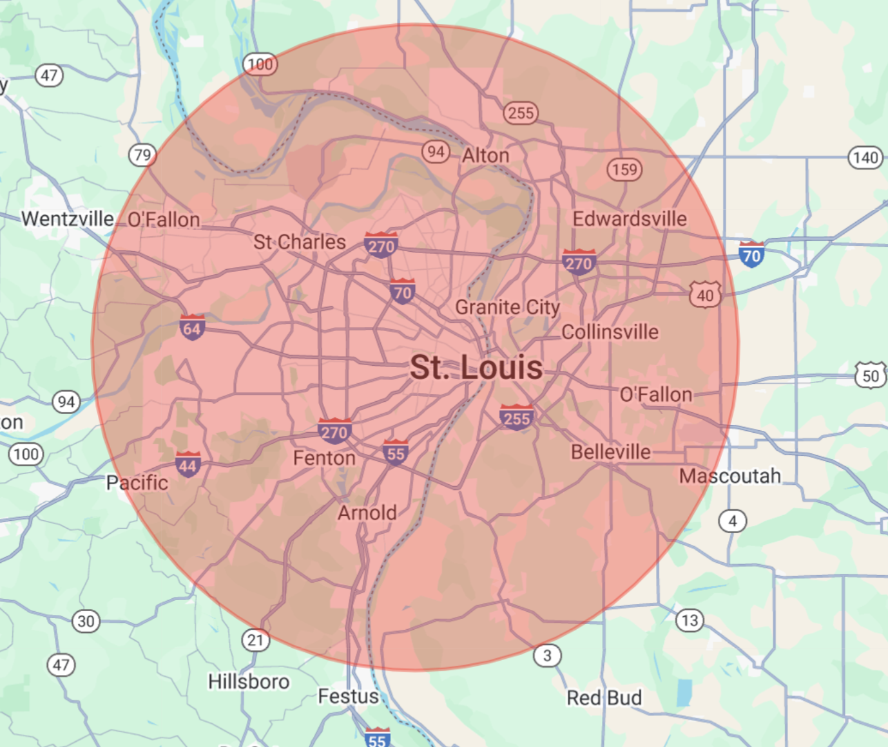
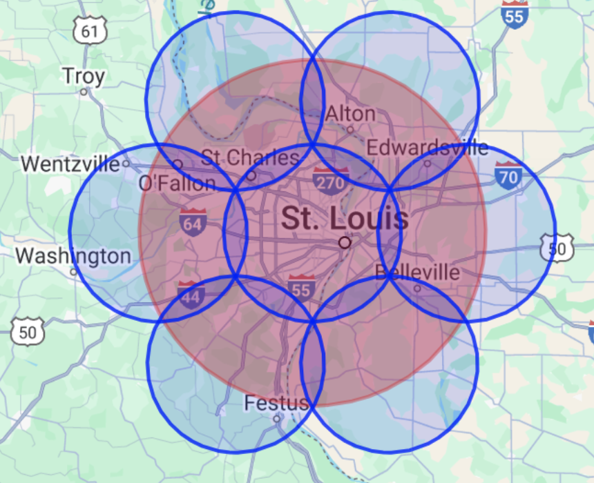
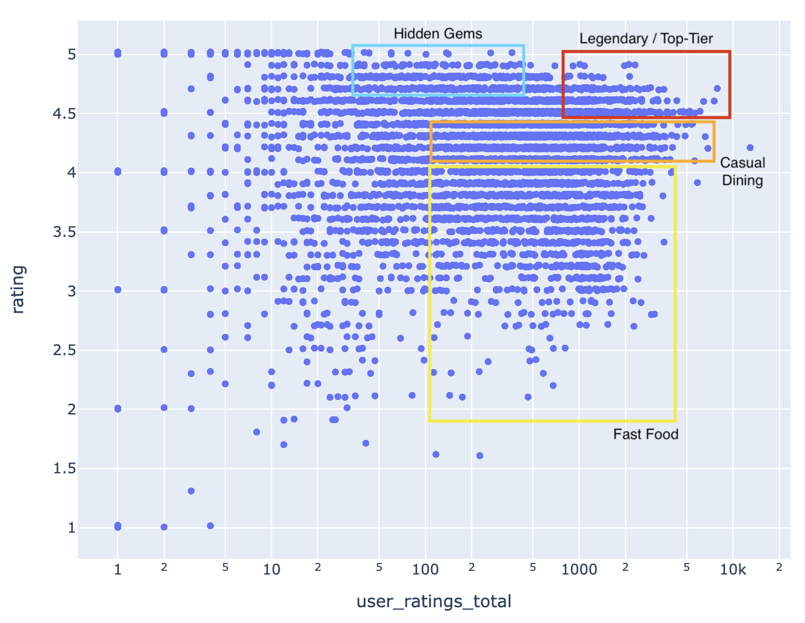

This is a project made to help people explore cities and tastes through data.

  <iframe src="../images/Projects/RestaurantFinderScreenshots/HTML/index.html" alt="St. Louis Restaurants" width="100%" height="600" style="border:none;"></iframe>
  <em>Top-rated restaurants registered on Google Maps in the St. Louis area with advanced filtering. There is already a strong filter applied so as not to overwhelm your browser with data from the complete set of restaurants in the St. Louis Metro area (5,808 restaurants).</em>

## Geospatial Fractal Geometry Saves the Day
It may not seem like a terribly ambitious venture to download a comprehensive list of restaurants in an area. I believed it would be trivial to download restaurant data from Google Maps--after all, there's an API for that! After researching the best ways to get this data, I created a Google Cloud Platform account so that I could plug into Google Places API. It turns out they have a nice function that lets you find restaurants within a circle of area on a map specified by latitude, longitude, and surrounding radius.

I thought my problem was solved: one query and that's it? There had to be a catch. When I wrote that code, I found that Google Places API returns a maximum of 60 results (that cannot be overridden), and there was no built-in way to grab ALL of the Places data within an arbitrary radius of area. So, I came up with the idea of breaking a large circle area into a series of smaller subcircle areas. The recursive algorithm is as follows: 

- Query a circle area.
- Examine the results
- - If Google Places API returns < 60 results: save the found restaurants data; that area is complete.
- - Else If Google Places API returns 60 results, generate the 7 smallest minimally-overlapping subcircles that cover the total area of the current circle, and recursively query each of those circles.

  

     
    <em>We can query Google Places API by querying a radius around a given longitude and latitude location.</em>
  

  

    
    <em>Visualization of breaking geographical radiuses into smaller subcircles recursively.</em>
  

Through this recursive process, this code guarantees that every restaurant registered by Google Places within an area radius is retrieved.

## Exploring the Data

This work was inspired by the underlying theory that superb restaurants are likely to be both highly-rated and have many reviews. However, Google doesn't currently let you filter all restaurants in a given area this way. My theory going into this was that there would be some "exceptional" restaurants that were outliers in terms of rating and number of reviews; it's easy to find a restaurant on Google with an average review of 4.9 stars, but it's very rare to find one that has 4.9 stars and 2000+ reviews. Below is a simple visualization that makes it easy:

  <iframe src="../images/Projects/RestaurantFinderScreenshots/Plotly/stl/stl_restaurants.html" alt="St. Louis Restaurant Ratings" width="100%" height="600" style="border:none;"></iframe>
  <em>All restaurants registered in Google Maps in St. Louis graphed by review count (log scale) and average review.</em>

When you dive into the data, there are many trends that surface:

     
    <em>Where do a lot of people eat, but don't think it's that great? Fast food. Where are places that people love, but not many know about? Hidden gems. What about the outliers in quality and reputation? Check out the Legendary/Top-Tier areas.</em>

## Other Applications of Rating Graphing

    <iframe src="../images/Projects/RestaurantFinderScreenshots/Plotly/all_beers.html" alt="St. Louis Restaurant Ratings" width="50%"  style="border:none;"></iframe>
    <em>Visualization of all beers with their average rating and review count from RateBeer dataset.</em>

    <iframe src="../images/Projects/RestaurantFinderScreenshots/Plotly/books.html" alt="St. Louis Restaurant Ratings" width="50%" style="border:none;"></iframe>
    <em>Visualization of all books on Goodreads (4-star+ reviews only) by their average rating and review count.</em>

## Next Steps
Since there is mass statistical inconsistency between populations that rank different restaurants, the overall rating is subject to much bias. I am interested in handling individual and group differences by exploring 1) reviewer-normalized rankings and 2) an ELO-based restaurant ranking system. For each of these approaches, I will need to download much more data. Instead of simply getting the number of reviews and average review of each restaurant, I will need to build a database of all individual reviewers who have reviewed any restaurant in a given radius, and build a social comparative network to rank restaurants in a way that mitigates subjective differences. If you have any ideas on how to get this kind of data, send me an email!

All code will be pushed after we finish user testing in May, but if you would like a copy, please reach out to me and I will send you the code!
