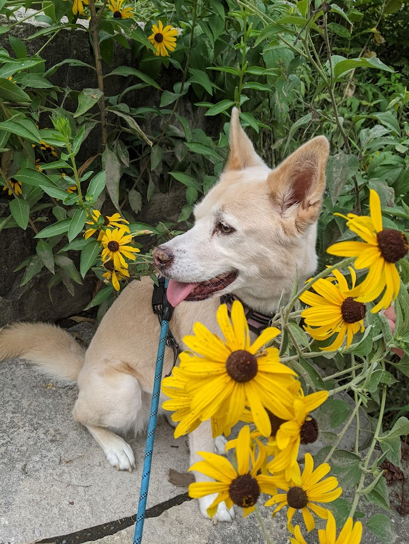

Using python to create personalized photo mosaics.

  

     
    <em>Original "target" photo.</em>
  

  

    
    <em>Generated mosaic.</em>
  

More coming soon!
## Avoiding Nearby Duplicates
## Scaling: Runtime Memory Optimization 