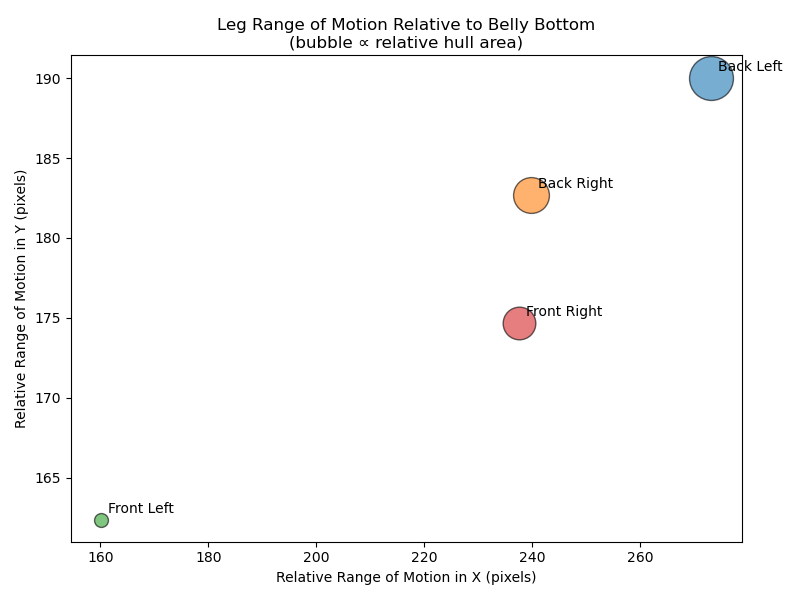

This is a proof-of-concept project to show the potential value of animal pose estimation for wildlife monitoring in vulnerable populations.

<article>
  <h1>How AI Tools Like DeepLabCut Can Transform Wildlife Monitoring</h1>

  
In recent years, artificial intelligence has opened exciting new frontiers for wildlife research. One tool at the forefront is <a href="https://www.deeplabcut.org/" target="_blank">DeepLabCut</a>, an open-source project that uses deep learning to track animal movements from videos—even when the footage comes from rugged trail cameras in the wild.

  <h2>Detecting Anomalies in the Wild</h2>

  
<strong>Imagine this:</strong> researchers analyzing trailcam footage notice a lone wolf limping across a clearing. By applying DeepLabCut, they can automatically annotate the wolf’s limb positions frame-by-frame. In one case study, I used DeepLabCut to show that such injuries may be detected automatically.

    
    <em>DeepLabCut annotates keypoint locations for an injured wolf. Video captured by the Voyageurs Wolf Project.</em>

  

  Deeplabcut is a great way to extract meaningful biomechanic data from wildlife cams. By extracting animal pose information, we can transform videos into insights. When you dive into the data, there are many trends that surface:
  

  

    
    <em>Scatterplots for each keypoint in each of the wolf's legs. This shows unusual Y overlap on the front left (injured) leg between the wolf's paw and knee. It also shows that while there is range of motion for three of the paws for each of the steps the wolf takes, the front left leg remains rigid, with the front paw protruding backwards relative to the knee.</em>
  

  
Rather than relying on slow manual observation, researchers could now detect and measure anomalies like this quickly, precisely, and at scale.

  

    
    <em>Calculating the range of motion for all joints on each leg shows us clearly that the front left leg is an outlier, with highly limited range of motion, indicating an injury. The back left leg has the largest range of motion, likely to make up for the injured front left leg. This additional motion is taxing over time, and can put the animal at risk for further injury.</em>
  

  <h2>Why This Matters</h2>

  
Subtle changes in posture, gait, or behavior can signal injury, illness, or environmental stress. Catching these signs early can help conservationists:

  <ul>
    <li>Monitor population health</li>
    <li>Understand the impact of habitat changes</li>
    <li>Intervene in cases of critical endangerment</li>
    <li>Build better models of animal behavior in natural settings</li>
  </ul>

  <h2>Other AI Tools Helping Wildlife Monitoring</h2>

  
While DeepLabCut focuses on pose estimation, a growing ecosystem of AI tools is helping researchers tackle other challenges:

  <ul>
    <li><strong><a href="https://github.com/microsoft/CameraTraps" target="_blank">MegaDetector</a></strong> – Developed by Microsoft AI for Earth, this tool automatically filters trailcam photos to detect animals (vs. humans or blank frames).</li>
    <li><strong><a href="https://github.com/m-bain/whisperX" target="_blank">WhisperX</a> + Speech Models</strong> – Transcribes and timestamps animal sounds, helping track vocalizing species like wolves and birds.</li>
    <li><strong><a href="https://github.com/ultralytics/ultralytics" target="_blank">YOLOv8 and Object Detection Models</a></strong> – Detect multiple species or individuals in camera footage with high accuracy.</li>
    <li><strong>Self-Supervised Learning Models</strong> – New methods allowing models to distinguish animals from their environment even with limited labeled data.</li>
  </ul>

  <h2>The Future: AI + Conservation</h2>

  
As AI models continue to improve, they can free researchers from tedious tasks, allowing them to focus on the bigger picture: protecting ecosystems, understanding behavior, and responding to threats more quickly.

  
From detecting a single wolf’s limp to surveying an entire forest's health, these tools are becoming essential allies in the future of conservation science.

  
<strong>Other applications:</strong> While conservation and wildlife are passions for me, these technologies can be useful to monitor and manage livestock, pets, and even humans in physical therapy and rehab.
</article>

